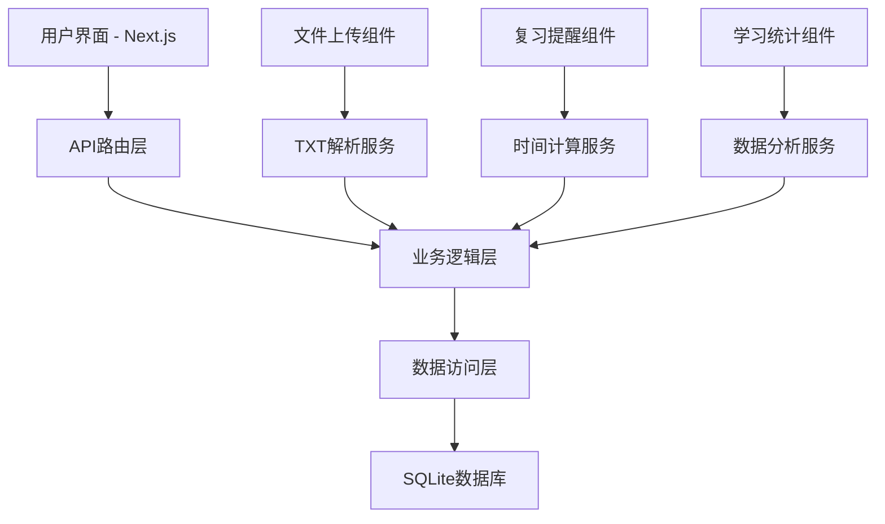

# 设计文档

## 概述

单词记忆系统是一个基于艾宾浩斯遗忘曲线的本地部署单词学习应用。系统采用Next.js作为前端框架，SQLite作为本地数据库，实现txt文件导入、智能复习提醒和学习进度跟踪功能。

## 架构

### 系统架构图



### 技术栈选择

- **前端**: Next.js 14 + TypeScript + Tailwind CSS
- **后端**: Next.js API Routes
- **数据库**: SQLite (本地部署，需要安装)
- **ORM**: Prisma (包含SQLite驱动)
- **文件处理**: Node.js fs模块
- **时间处理**: date-fns库

### 环境要求

#### SQLite安装
- **Windows**: 下载SQLite预编译二进制文件或使用包管理器
- **macOS**: 通过Homebrew安装 `brew install sqlite`
- **Linux**: 通过包管理器安装 `sudo apt-get install sqlite3`
- **Node.js环境**: Prisma会自动处理SQLite驱动，无需单独安装

## 组件和接口

### 核心组件

#### 1. 文件导入组件 (WordImporter)
```typescript
interface WordImporterProps {
  onImportSuccess: (count: number) => void;
  onImportError: (error: string) => void;
}
```

#### 2. 复习管理组件 (ReviewManager)
```typescript
interface ReviewManagerProps {
  currentTime: Date;
  onReviewComplete: (wordId: string, reviewTime: string) => void;
}
```

#### 3. 学习统计组件 (StudyStats)
```typescript
interface StudyStatsProps {
  userId?: string;
  dateRange?: { start: Date; end: Date };
}
```

### API接口设计

#### 1. 单词导入接口
```typescript
// POST /api/words/import
interface ImportRequest {
  file: File; // txt文件
}

interface ImportResponse {
  success: boolean;
  message: string;
  importedCount: number;
  errors?: string[];
}
```

#### 2. 获取复习单词接口
```typescript
// GET /api/review/current
interface ReviewResponse {
  words: Array<{
    word: string;
    meaning: string;
    phonetic?: string;
    partOfSpeech: string;
    example?: string;
    reviewType: 'A' | 'B' | 'C' | 'D' | 'E' | 'F' | 'G';
    timeWindow: {
      start: string;
      end: string;
    };
  }>;
}
```

#### 3. 完成复习接口
```typescript
// POST /api/review/complete
interface CompleteReviewRequest {
  word: string;
  reviewType: 'A' | 'B' | 'C' | 'D' | 'E' | 'F' | 'G';
  completedAt: string;
}

interface CompleteReviewResponse {
  success: boolean;
  message: string;
}
```

## 数据模型

### 数据库表设计

#### 1. 单词表 (words)
```sql
CREATE TABLE words (
  word TEXT PRIMARY KEY,
  meaning TEXT NOT NULL,
  phonetic TEXT,
  part_of_speech TEXT NOT NULL,
  example TEXT,
  imported_at DATETIME NOT NULL DEFAULT CURRENT_TIMESTAMP
);
```

#### 2. 复习规则表 (review_rules)
```sql
CREATE TABLE review_rules (
  id INTEGER PRIMARY KEY AUTOINCREMENT,
  rule_name TEXT NOT NULL UNIQUE, -- A, B, C, D, E, F, G
  offset_days INTEGER NOT NULL,   -- 0, 0, 1, 2, 4, 7, 15
  specific_time TEXT NOT NULL,    -- 14:00, 21:00, 07:00, etc.
  is_enabled BOOLEAN NOT NULL DEFAULT TRUE,
  created_at DATETIME NOT NULL DEFAULT CURRENT_TIMESTAMP
);
```

#### 3. 学习状态表 (word_study_records)
```sql
CREATE TABLE word_study_records (
  id INTEGER PRIMARY KEY AUTOINCREMENT,
  word TEXT NOT NULL,
  review_time_a_start DATETIME,
  review_time_a_end DATETIME,
  review_time_b_start DATETIME,
  review_time_b_end DATETIME,
  review_time_c_start DATETIME,
  review_time_c_end DATETIME,
  review_time_d_start DATETIME,
  review_time_d_end DATETIME,
  review_time_e_start DATETIME,
  review_time_e_end DATETIME,
  review_time_f_start DATETIME,
  review_time_f_end DATETIME,
  review_time_g_start DATETIME,
  review_time_g_end DATETIME,
  completion_status TEXT NOT NULL, -- JSON格式
  reset_count INTEGER NOT NULL DEFAULT 0,
  created_at DATETIME NOT NULL DEFAULT CURRENT_TIMESTAMP,
  FOREIGN KEY (word) REFERENCES words(word)
);
```

### 数据模型接口

```typescript
interface Word {
  word: string;
  meaning: string;
  phonetic?: string;
  partOfSpeech: string;
  example?: string;
  importedAt: Date;
}

interface ReviewRule {
  id: number;
  ruleName: 'A' | 'B' | 'C' | 'D' | 'E' | 'F' | 'G';
  offsetDays: number;
  specificTime: string;
  isEnabled: boolean;
  createdAt: Date;
}

interface WordStudyRecord {
  id: number;
  word: string;
  reviewTimeAStart?: Date;
  reviewTimeAEnd?: Date;
  reviewTimeBStart?: Date;
  reviewTimeBEnd?: Date;
  reviewTimeCStart?: Date;
  reviewTimeCEnd?: Date;
  reviewTimeDStart?: Date;
  reviewTimeDEnd?: Date;
  reviewTimeEStart?: Date;
  reviewTimeEEnd?: Date;
  reviewTimeFStart?: Date;
  reviewTimeFEnd?: Date;
  reviewTimeGStart?: Date;
  reviewTimeGEnd?: Date;
  completionStatus: CompletionStatus;
  resetCount: number;
  createdAt: Date;
}

interface CompletionStatus {
  [key: string]: '待打卡' | '已完成' | '延迟完成';
}
```

## 错误处理

### 错误类型定义

```typescript
enum ErrorType {
  FILE_FORMAT_ERROR = 'FILE_FORMAT_ERROR',
  DATABASE_ERROR = 'DATABASE_ERROR',
  VALIDATION_ERROR = 'VALIDATION_ERROR',
  TIME_CALCULATION_ERROR = 'TIME_CALCULATION_ERROR'
}

interface AppError {
  type: ErrorType;
  message: string;
  details?: any;
}
```

### 错误处理策略

1. **文件格式错误**: 提供详细的格式要求和示例
2. **数据库错误**: 记录错误日志，提供用户友好的错误信息
3. **时间计算错误**: 回退到默认时间配置
4. **网络错误**: 实现重试机制

## 测试策略

### 单元测试

- 时间计算逻辑测试
- 文件解析功能测试
- 数据库操作测试
- 复习状态更新测试

### 集成测试

- API接口测试
- 数据库集成测试
- 文件上传流程测试

### 端到端测试

- 完整的单词导入流程
- 复习提醒和完成流程
- 学习统计功能测试

测试框架: Jest + React Testing Library + Playwright